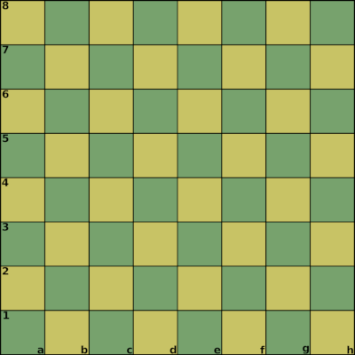

# Callatis

by Afrasinei Alexandru Iulian

## Introduction

Callatis is a board game that utilizes a standard chess board and Callatis specific pieces.

In Callatis, two fleet commanders engage in a space battle.

The objective is to utilize the available structures and ships to defeat the enemy

and destroy their base.

## The elements of Callatis

* one chess board (8x8)

* White/Black
    * Pieces shapes
    
        * 1 base (king, large box)

        * 4 inactive gates (black backgammon pieces)

        * 4 active gates (white backgammon pieces)

        * 4 jump gates (white backgammon pieces, semicylinders)

        * 8 frigates (pawns, half large box (positioned toward oponent (I)) )

        * 2 sentries (towers, small boxes)

        * 2 towers (bishops, medium boxes)

        * 1 flagship (queen, triangle box)

## The board

A standard chess board (8x8).

## The pieces

### Base

### Inactive gates

### Active gates

### Jump gates

### Frigates

### Sentries

### Towers

### Flagship

## The rules of placement

### Setup

**Base**

The white player starts first by placing the base on their back row.

Next the black player places their base.

The base can be placed anywhere on the back row.

**Gates**

The inactive gates are placed first,

One gate is placed per row, following a sequential order starting from the back row and moving up.

Only one gate can exist per row.

On the back row, the gate must be positioned at least one step away from the base.

**Frigates, Sentries, Towers, Flagship**

These pieces can be placed anywhere in the back row, with the exception of directly on a gate.

Sentries and towers can be placed once all eight gates have been deployed.

**Flagship**

The flagship is only available after a friendly frigate arrives on the back row of the enemy.

## Endgame

## Credits, contact

Afrasinei Alexandru Iulian

Email:

alexandruafrasinei@gmail.com
